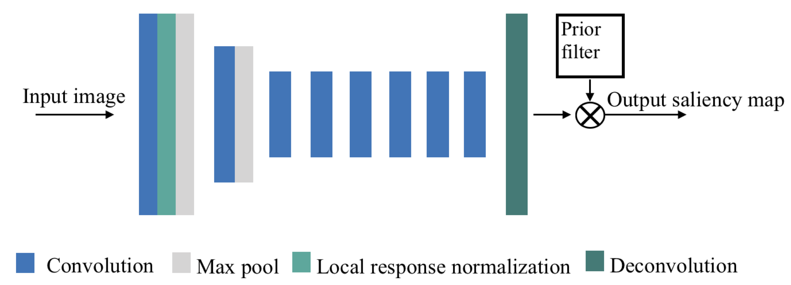
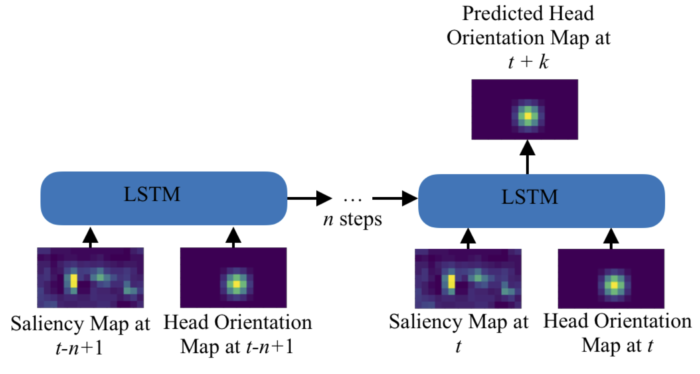

# Your Attention is Unique: Detecting 360-Degree Video Saliency in Head-Mounted Display for Head Movement Prediction
This repository contains the source code for the PanoSalnet model in the ACMMM18 paper:

Anh Nguyen, Zhisheng Yan, and Klara Nahrstedt 2018. Your Attention is Unique: Detecting 360-Degree Video Saliency in Head-Mounted Display for Head Movement Prediction. In ACM Multimedia Conference for 2018 (ACMMM2018)

To cite our paper, use this Bitex code: 
```
@inproceedings{panosalnet2018,
  author = {Nguyen, Anh and Yan, Zhisheng and Nahrstedt, Klara},
  title = {{Your Attention is Unique: Detecting 360-Degree Video Saliency in Head-Mounted Display for Head Movement Prediction}},
  booktitle = {ACM Multimedia Conference for 2018 (ACMMM2018)},
  year = {2018}
}
```
# Abstract
Head movement prediction is the key enabler for the emerging 360-degree videos since it can enhance both streaming and rendering efficiency. To achieve accurate head movement prediction, it becomes imperative to understand user's visual attention on 360-degree videos under head-mounted display (HMD). Despite the rich history of saliency detection research, we observe that traditional models are designed for regular images/videos fixed at a single viewport and would introduce problems such as central bias and multi-object confusion when applied to the multi-viewport 360-degree videos switched by user interaction. To fill in this gap, this paper shifts the traditional single-viewport saliency models that have been extensively studied for decades to a fresh panoramic saliency detection specifically tailored for 360-degree videos, and thus maximally enhances the head movement prediction performance. The proposed head movement prediction framework is empowered by a newly created dataset for 360-degree video saliency, a panoramic saliency detection model and an integration of saliency and head tracking history for the ultimate head movement prediction. Experimental results demonstrate the measurable gain of both the proposed panoramic saliency detection and head movement prediction over traditional models for regular images/videos.

## Saliency Groundtruth Generation.

## PanoSalNet

### Installation
1. Install Caffe. We use Python Caffe. Please refer to Caffe [website](http://caffe.berkeleyvision.org/installation.html) for installation instruction.
2. Get the code.
  ```Shell
  git clone https://github.com/phananh1010/PanoSalNet.git
  cd PanoSalnet
  git checkout master
  ```
### Preparation
1. Download our model weight file [here](https://www.dropbox.com/s/smiplkpqlv0npsm/panosalnet_iter_800.caffemodel?dl=0)
2. Copy the file to the same folder with panosalnet.py file. 

### Test/Evaluation
To run our model, please refer to panosalnet.py.

## LSTM Head Prediction


### Installation
1. Install [Keras](https://keras.io/#installation), then install [Tensor Flow](https://www.tensorflow.org/install/) as backend.
2. Install [pyquaternion](http://kieranwynn.github.io/pyquaternion/)
3. Get the code.
  ```Shell
  git clone https://github.com/phananh1010/PanoSalNet.git
  cd PanoSalnet
  git checkout master
  ```
### Preparation
1. Download LSTM Head Prediction model weight [here](https://www.dropbox.com/s/z0ygecs9oyf59v5/model3_360net_128_w16_h9_8000?dl=0).
2. Copy the file to the same folder with lstm.py file. 

### Test/Evaluation
To run head prediction model, refer to lstm.py


# Contact
If you have any general doubt about our work, please use the [public issues section](https://github.com/phananh1010/PanoSalNet/issues) on this github. Alternatively, drop us an e-mail at <mailto:anguyen139@student.gsu.edu> or <mailto:zyan@gsu.edu>.
